# 캐릭터 애니메이션 : 파쿠르 시스템
* 진행 기간 : `2026.06.30 ~ 2026.08.20`
* 개발 인원 : 1명
* 툴 및 언어 : Visual Studio, C++, Blender 3D
* 기술 스택 : DirectX 11, PhysX5, ImGui, Assimp, C++17

## 프로젝트 개요
파쿠르 캐릭터 애니메이션 시스템 연구를 위해 DirectX11과 PhysX를 기반으로 자체 미니 엔진을 직접 구축하고, 
지형 인식 및 모션 선택 시스템으로 파쿠르 애니메이션을 구현한 프로젝트입니다.

연구는 3D 환경에서 캐릭터로 하여금 여러 유형의 지형을 인식하는 방법과
캐릭터의 상태에 따라 어떤 모션을 재생할 것인지 선택하는 과정을 구현하는 것을 중점으로 진행했습니다.

이를 위해 단순 레이캐스트 방식 대신 BehaviorTree 방식을 응용한 동적 레이캐스트 구조를 설계했습니다.

### 엔진 기반
파쿠르 시스템을 얹기 위한 토대도 구현했습니다.<br/>
상세는 [기타 › 엔진 기반 상세](#엔진-기반-상세)에 정리했습니다.

| 영역 | 내용 |
|---|---|
| 렌더링 | DirectX 11, Lambert 셰이딩, GPU 스키닝(본 행렬 128개 상수 버퍼) |
| 오브젝트 모델 | 언리얼식 Actor / Component / Scene 계층 + 컴포넌트 정렬 순서 제어 |
| 애셋 | 자체 바이너리 포맷 `.mini` (메시 · 스켈레톤 · 클립 통합 컨테이너) + Assimp 베이커 |
| 물리 | PhysX 5 강체 · 캐릭터 컨트롤러(CCT) · 충돌 레이어 필터 |
| 애니메이션 | 블렌드 스페이스(들로네 삼각분할) · 상태머신 · 루트모션 · 2본 IK |
| 도구 | ImGui 에디터(베이킹 · 클립 편집) + 인게임 디버그 패널 전용 빌드 구성 |

### 시연 영상 링크
[](https://youtu.be/gJBwXp-Pabs)

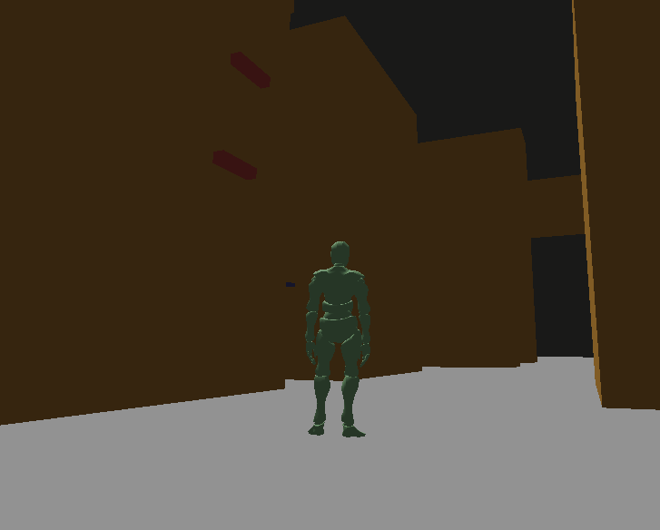

- 본 영상에서 사용된 리소스는 [Mixamo](https://www.mixamo.com/)에서 다운받아 사용했으며,
레포지토리에 포함되어 있지 않습니다.

### 목차
1. [핵심 기능](#핵심-기능)
1. [트러블슈팅](#트러블슈팅)
1. [회고](#회고)
1. [기타](#기타)

<br/>

# 핵심 기능
## 전체 구조

파쿠르 시스템은 **지형 인식 → 결과 처리 → 액션 재생** 세 단계로 진행됩니다.<br/>
파쿠르 시도에서 셋을 분리한 것이 이 프로젝트의 핵심 구조입니다.

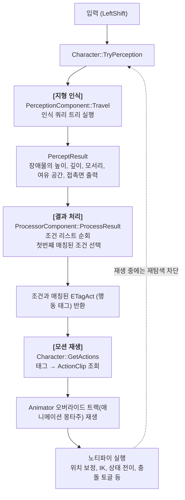

세 단계에 필요한 구성 데이터는 각각 **JSON 데이터**에서 로드됩니다.

| 단계 | 데이터 파일 | 규모 | 상세 |
|---|---|---|---|
| 측정 | `Datas/PerceptionQueryData_0.json`, `~_1.json` | 노드 72개 + 데코레이터 22개 / 노드 3개 | `PerceptionQueryData_0.json` : 기본 측정 방식,<br/> `PerceptionQueryData_1.json` : 낙하 시 측정 |
| 결과 처리 | `Datas/ProcessConditionData_0.json`, `~_1.json` | 조건 100개·룰 55개 / 조건 8개·룰 4개 | `ProcessConditionData_0.json` : 기본 측정 후 결과 처리,<br/> `ProcessConditionData_1.json` : 낙하 시 측정 후 결과 처리 |
| 출력 | `Datas/CharacterActionClips.json` | 로코모션 6 + 액션 61 |
| 튜닝 | `Datas/CharacterConfig.json` | 측정 파라미터 13개 |

이 세 과정을 `enum class ETagAct : uint8_t` 가 연결합니다.

결과 처리 단계에서 나오는 결과값, 클립 테이블이 받는 것도 값도 이 enum이라, 규칙 JSON 과 클립 JSON이 서로를 직접 알지 못해도 연결됩니다.

<br/>

## 1. 파쿠르 지형 인식 시스템

### 문제 배경

파쿠르 동작을 고르려면 눈앞의 지형을 **수치 값으로** 알아야 했습니다. 그리고 이때 필요한 값은 하나가 아니었으며 최소한으로 필요하겠다 싶은 값들은 다음과 같았습니다.

- 지형의 높이 (`height`) : 얼마나 **높은가** (넘을 수 있는 턱인가, 올라타야 하는 벽인가)
- 지형의 깊이 (`depth`) : 윗면이 얼마나 **깊은가** (뛰어넘을 수 있나, 올라서야 하나)
- 지형의 모서리 위치 (`ledge`) : 잡을 **모서리**가 있는가
- 지형의 여유 공간 (`room`) : 올라섰을 때 머리 위 **여유 공간**이 있는가

처음에는 이 값들을 하나의 함수 안에서 레이캐스트를 순서대로 쏘아 구했습니다.
그런데 이 방식은 두 가지 문제가 있었습니다.

#### 첫째, 상황마다 측정 방식, 순서가 다름
벽에 매달린 상태에서 위로 올라갈 곳을 찾을 때와,
땅에서 달려와 턱을 만났을 때는 쏘아야 할 레이의 시작점, 방향, 횟수가 달랐습니다.

그리고 상정한 상황 외에도 추가적인 상황에 따라 지형을 측정하는 방식이 달라질 수 있습니다.

이런 과정을 한 함수에 담으면 캐릭터 상태와 입력 방향을 검사하는 `if` 가 계속 늘어나며 코드의 복잡도와 유지보수 난이도가 올라갑니다.

#### 둘째, 레이캐스트 사용에서 낭비가 발생
**다 쏘고 나서 판단**하는 구조에서는 지형 측정을 위해 레이캐스트를 사용하는 횟수가 얼마나 필요한지 미리 알 방법이 없습니다.

벽에 매달려 있는데 발밑 지면을 재거나, 장애물이 아예
없는데 높이를 측정하기 위해 레이캐스트를 여러번 올라가며 쏘는 것은 의미가 없습니다.

#### 문제 정리
이 두 이유를 바탕으로 문제를 정의하자면 **지형 측정 시, 제어 흐름의 필요**이었습니다.

### 해결 아이디어 : 측정 과정을 트리로 만든다

AI의 Behavior Tree(이하 BT) 를 빌려왔습니다. BT는 "지금 상황에서 어떤 행동을 할지" 를 조건부로
갈라 내려가는 구조인데, 여기서는 **"지금 상황에서 어떤 측정을 할지"** 를 갈라 내려가게 했습니다.

캐릭터의 상태, 현재 위치나 인식한 장애물 종류에 따라 조건 분기를 타고, 아래로 갈수록 구체적인 상황에서 탐색 task를 수행합니다.
task는 지형을 측정하기 위한 레이캐스트를 쏘는 절차를 수행합니다.

이렇게하여 트리를 타고 내려가는 경로를 구성하면<br> 특정한 구체적인 상황에서 필요한만큼 레이캐스트를 쏘는 방식, 순서 등을 결정할 수 있습니다.

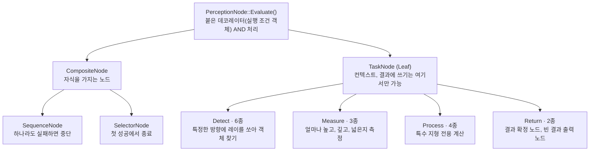

설계할 때 정한 규칙이 두 가지 있습니다.

#### 1. Context, Result Write 권한 제한 : Task 노드만 가능
**쓰기 권한을 Leaf만 가능하게 제한했습니다.** 

탐색 도중의 값은 `TravelContext::intermediate` 라는 임시값에만 쌓이고, 실제 결과로 출력하는 것은 `ReturnResultNode` 하나입니다.

중간에 실패해서 다른 가지로 넘어가도 이전 가지가 남긴 값이 결과를 오염시키지 않도록 하기 위함입니다.

```cpp
// Perception/PerceptionComponent.h
// Leaf 노드 - 최종 작업 수행
// Context Write는 오로지 Task에서만 수행하기
class TaskNode : public PerceptionNode
{
public:
    EPerceptionResult Execute(TravelContext& _context, PerceptResult& _result) override;

    virtual EPerceptionResult InvokeTask(TravelContext& _context, PerceptResult& _result) = 0;
};
```
#### 2. 한 노드의 여러 데코레이터(조건)는 AND 연산 처리
조건을 여러 개 붙였다는 것은 "둘 다 통과해야한다"는 의도로 간주합니다.

OR 이 필요하면 `SelectorNode` 로 가지를 나눕니다.<br/>
논리 연산자를 데이터에 넣는 대신 **트리 모양으로 표현**하게 했습니다.

### 구현 예시
TaskNode의 실제 구현 예시입니다.
- **`MeasureObstacleHeightNode`** : 발 높이부터 `heightStep`(0.5m) 간격으로 SphereCast를 쌓아 올리며
  전방으로 짧게 레이를 쏩니다. **맞다가 처음으로 빗나간 레이가**이 윗면입니다. 그 뒤 `ObstacleLedge`
  레이어로 한 번 더 쏘아, 모서리 콜라이더가 있으면 거기에 정밀하게 탐지합니다.
- **`MeasureObstacleDepthNode`** : 윗면에서 `depthStep`(0.5m)씩 전진하며 아래로 레이를 쏩니다.
  아무것도 안 맞거나, 그 높이에 다른 장애물이 맞으면 거기까지가 깊이입니다.
- **`CheckRoomNode`** : 올라섰을 때 머리 위 여유 공간을 확인합니다.
장애물에 올라 선 후, 캐릭터가 끼는 상황을 방지하기 위함입니다.

Root 노드는 **캐릭터 상태로 가지를 나누는 `SelectorNode`** 입니다.<br/>
"지금 캐릭터가 어떤 상태에서 어떤 종류의 지형을 인식했는가" 를 가장 큰 분기로 설정했습니다.

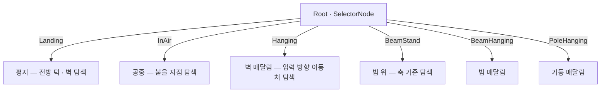

### 데이터화

처음엔 노드를 C++로 작성하다 보니 트리 모양을 바꿀 때마다 재컴파일이 필요했습니다. 또한, 수정할 때 코드 관리가 불편할 것으로 예상했습니다.

그래서 트리를 **노드 리스트 + id 참조** 형태의 JSON 으로 옮겼습니다.

중첩 JSON 이 아니라 리스트를 택한 이유는 **노드 공유**하고자 했기 때문입니다.<br/>
`Return` 이나 `공통 조건 검사`처럼 여러 가지에서 같은 노드를 가리켜야 하는 경우가 있었고, 중첩 구조에서는 그때마다 복제하는 것이 비효율적이라 생각하여 노드를 공유할 수 있도록 했습니다.

다음은 예시로 [착지 판정용 트리](`Datas/PerceptionQueryData_1.json`)를 넣었습니다.

```jsonc
{
  "comment_desc": "캐릭터가 착지했을 때, 아래 장애물을 탐색하기 위해 사용하는 트리",
  "root": "Root",
  "decos": [],
  "nodes": [
    { "id": "Root", "class": "SequenceNode",
      "children": [ "DetectDown", "Return" ] },

        { "id": "DetectDown", "class": "DetectFloorNode",
          "startOffset": [ 0.0, 0.0, 0.0 ],
          "direction":   [ 0.0, -1.0, 0.0 ],
          "distance": 0.1, "radius": 0.25 },

        { "id": "Return", "class": "ReturnResultNode" }
  ]
}
```
들여쓰기는 문법상 의미는 없고 사람이 트리 깊이를 눈으로 따라가기 위한 것입니다.

### 결과
- 노드 **18종** · 데코레이터 **7종** 으로 실사용 트리(노드 72 + 데코 22)를 구성했습니다. 전체 목록은
  [기타 › 인식 노드 · 데코레이터 목록](#인식-노드--데코레이터-목록) 참고.
- 상황별로 **필요한 레이만** 쏩니다. 디버그 빌드에 레이캐스트 호출 카운터를 넣어
  (`AddRaycastUsageCnt`, 탐색 1회마다 리셋) 인게임 패널에서 실시간으로 확인할 수 있게 했습니다.
  "장애물이 없으면 1발, 높은 벽이면 십수 발" 처럼 상황에 비례해 움직이는 것을 눈으로 봅니다.
- 새 측정 절차는 JSON 편집만으로 만듭니다. 새 종류의 측정이 필요할 때만 노드 클래스를 추가합니다.

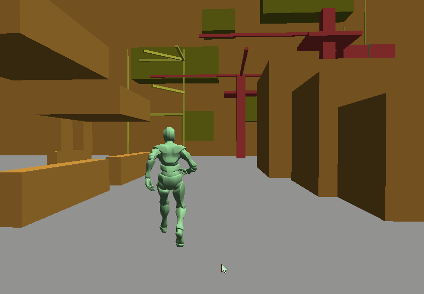

<br/>

## 2. 인식 결과 처리
### 문제 배경

측정이 끝나면 `PerceptResult` 에 측정한 결과값들이 담깁니다. 
이제 이 값을 가지고 조건에 맞는 **액션**으로 골라야 합니다.

```
높이 1.2m · 깊이 0.5m · 모서리 있음 · 정면       →  VaultMid
높이 1.2m · 깊이 1.5m · 모서리 있음 · 정면       →  MantleMid
높이 3.0m · 모서리 있음                          →  Wall_RunToHang
```

처음에는 지형을 인식하고 결과값을 이용해서 바로 액션을 반환했습니다.
하지만 결과 처리 부분을 따로 구성하게된 두 가지 이유가 있었습니다.

#### 1. 측정 과정은 동일하지만, 반환할 결과는 달라야 하는 경우
그 과정에서 **측정 과정은 같지만** 반환해야하는 **결과만 상태에 따라 다르게** 반환해야하는 경우가 발생했습니다.

예를 들면, 평지에서 낮은 담을 넘는 경우와, 공중에서 떨어질 때 낮은 담을 인식하고 넘어야하는 경우가 있습니다.
둘다 지형을 인식 - 높이 측정 - 깊이 측정을 통한 과정은 동일합니다.

하지만, 평지 시에는 평지 상태에서 담을 넘는 모션이 재생되어야하고, 공중에서는 매달린 후 담을 넘는 모션이 재생될 필요가 있습니다.
이런 경우와 같이 측정 절차를 위한 트리 구성은 동일하지만 반환하는 액션 태그의 결과가 달라질 필요가 있었습니다.

#### 2. 액션 다양화에 따른 결과 처리 코드 관리의 한계
데이터화 전, 처음에는 `if`문으로 된 코드였습니다. 
그런데 파쿠르 동작이 늘면서 이게 빠르게 무너졌습니다.

보다 디테일하게 상황별로 모션을 선택할 필요가 있었고
이에 맞게 지형 인식에서 측정하는 요소들도 다양화되며 
결과 처리 부분을 코드로 관리하는 것은 적절하지 않다고 생각했습니다.

당시 문제를 메모하며 발생했던 문제들은 다음과 같았습니다.

- 조건이 **높이, 깊이, 상태, 입력 방향, 장애물 종류, 낙하 시간** 등 여러 요소의 조합으로 늘어날 수 있습니다.
  요소가 하나 늘 때마다 전체 코드를 다시 봐야 합니다. (사이드 이펙트)
- 같은 조건 검사가 여러 분기에 **중복**될 수 있었습니다. (중복 조건)
- 어느 분기가 걸렸는지 알려면 로그를 심어야 합니다. (디버깅 어려움)
- 무엇보다 **동작 하나 추가에 재컴파일**이 필요합니다. 파쿠르는 숫자 튜닝이 곧 작업인데,
  임계값 0.1 을 바꾸려고 빌드를 기다리는 게 병목이었습니다. (작업 병목)

### 해결 아이디어 : 조건의 객체화, 결과 처리 규칙 설정 
이런 문제를 해결하기 위해서 지형 인식 부분과 결과 처리 부분, 두 가지를 분리했습니다.

#### 1. 조건 객체화
기존 코딩된 조건들을 재사용 가능하도록 객체화했습니다.

`ProcessCondition` 을 상속한 판정 객체를 만들고 `ConditionAnd` / `ConditionOr` 로 합성합니다.
각 조건에 이름(id)을 붙여 여러 규칙이 **같은 객체를 공유**합니다.

#### 2. 결과 처리 규칙
조건들을 만족하면 액션 태그값을 반환하도록 순서 있는 목록을 작성합니다.
`{ 조건 id → 행동 태그 }` 쌍을 선언 순서대로 평가하고
**제일 먼저 조건을 충족하는 쌍에서 종료**합니다. 
**파일에서의 순서**를 우선순위로 활용했습니다.
**위쪽은 까다롭고 구체적인 규칙, 아래로 갈수록 느슨한 규칙**을 두고, 맨 아래에 "장애물이 있기만 하면" 수준으로 폴백을 구성합니다.

다음은 예시로 [착지 처리 규칙](`Datas/ProcessConditionData_1.json`) 전체를 넣었습니다. .

```jsonc
{
  "conditions": [
    { "id": "ObstacleIsDetected", "class": "ObstacleDetectedCondition" },
    { "id": "Falling_Long", "class": "CharacterFallingTimeCondition", "value": 0.8 },
    { "id": "Falling_Mid",  "class": "CharacterFallingTimeCondition", "value": 0.3 },
    { "id": "IsBeam", "class": "ObstacleTypeCondition", "targetObstacleType": "Beam" },

    { "id": "Landing_OnBeam",   "class": "ConditionAnd",
      "children": [ "ObstacleIsDetected", "IsBeam" ] },
    { "id": "Landing_FromHigh", "class": "ConditionAnd",
      "children": [ "ObstacleIsDetected", "Falling_Long" ] },
    { "id": "Landing_FromMid",  "class": "ConditionAnd",
      "children": [ "ObstacleIsDetected", "Falling_Mid" ] },
    { "id": "Landing_Fallback", "class": "ConditionAnd",
      "children": [ "ObstacleIsDetected" ] }
  ],

  "processDatas": [
    { "tagAct": "BeamStand",          "conditionId": "Landing_OnBeam"   },
    { "tagAct": "FallingToLandRoll",  "conditionId": "Landing_FromHigh" },
    { "tagAct": "FallingToLandFront", "conditionId": "Landing_FromMid"  },
    { "tagAct": "FallingToLand",      "conditionId": "Landing_Fallback" }
  ]
}
```

`ObstacleIsDetected` 하나를 네 규칙이 공유하고, 아래로 갈수록 조건이 빠지면서 느슨해집니다.

### 구현 세부
**조건 평가는 1회만 합니다.** 조건 객체가 여러 규칙에 공유되므로, 55개 규칙을 훑으면 같은
조건이 수십 번 평가될 수 있습니다. `ProcessCondition` 이 `m_bIsProcessed` 플래그로 결과를
메모이즈하고, `ProcessResult` 시작 시 해당 세트만 `Reset()` 합니다.

**연출용 인디렉션.** 매치 결과가 예약값 `Reserved_Direct` 면, 실제 태그를 장애물 객체
(`IDirectable::GetDirectTagAct`)에서 가져옵니다. "이 장애물에서는 무조건 이 모션" 같은
일회성 연출을 규칙 테이블을 건드리지 않고 **레벨 배치 쪽에서** 지정할 수 있습니다.

### 결과 : 생산성
데이터화 후, 가장 큰 장점은 수정과 테스트가 용이해지면서 얻은 생산성입니다.
지형을 인식하고 처리하는 과정들을 데이터화하며 재컴파일할 필요없이 데이터 파일을 수정하여
보다 빠른 테스트와 시도를 할 수 있었습니다.

| 작업 | 이관 전 | 이관 후 |
|---|---|---|
| 임계값 조정 | C++ 수정 → 재컴파일 | JSON 수정 → 재실행 |
| 새 규칙 추가 | `if` 사다리 삽입 위치 고민 + 재컴파일 | JSON 에 2줄 |
| 조건 조합 변경 | 조건식 재작성 | `children` 배열 편집 |
| **새 판정 요소 추가** | C++ 수정 | **C++ 수정** (조건 클래스 + 등록 4~6곳) |

현재 규모는 조건 100개 · 규칙 55개이고, 출력하는 행동 태그는 48종입니다.
조건 클래스는 18종으로 [기타 › 처리 조건 목록](#처리-조건-목록)에 정리했습니다.

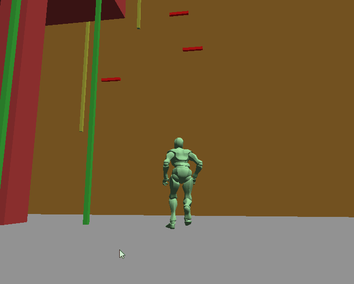

<br/>

## 3. 결과 모션 출력

### 애니메이션 재생 구조

`Animator` 는 **두 트랙**으로 합성합니다.

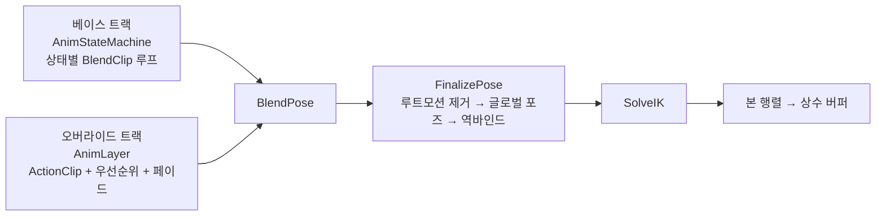

- **베이스 트랙**은 캐릭터 상태(`EState`)마다 하나씩 있는 블렌드 스페이스입니다.
  들로네 삼각분할(Bowyer–Watson) + 질량중심좌표로 속도 · 방향에 따라 클립을 섞습니다.
  상태가 바뀌면 이전 상태와 크로스페이드합니다.
- **오버라이드 트랙**은 파쿠르 동작처럼 한 번 재생하고 끝나는 클립 슬롯입니다. (애니메이션 몽타주 용도)
  우선순위(`Default` / `Override`)로 덮어쓰기를 통제하고, 클립 끝에서 자동으로 페이드아웃합니다.

파쿠르 동작은 전부 오버라이드 트랙으로 동작합니다. `Override` 우선순위 클립이 재생 중이면
`TryPerception` 이 조기 반환하므로, **동작 중 재탐색이 차단**되어 루프가 닫힙니다.

### 태그로 잇기
행동 태그 `ETagAct` 가 규칙 JSON 과 클립 JSON 의 공통 사용값입니다.

```cpp
// Content/Character.cpp — 분류 결과를 그대로 클립 조회 키로 사용
if (std::shared_ptr<ActionClip> pAction = GetActions(processResult))
    PlayActionClip(pAction, 0.2f, (uint8_t)EActionPriority::Override);
else
    MG_LOG_WARN("[Character::ProcessPerceptionResult] no action matched with {}", processResult);
```

문자열 태그의 오타를 빌드 타임에 잡기 위해 이름표 배열에 `static_assert` 를 걸었습니다.
enum 에 값을 추가하고 이름표를 빠뜨리면 컴파일이 실패합니다.

```cpp
// Content/ContentConfig.cpp
static_assert(IsEveryTagActNamed(), "TAG_ACT_NAMES 가 ETagAct 와 불일치");
```
같은 패턴을 `STATE_NAMES`(캐릭터 상태), `LIMB_NAMES`(사지), `CORRECT_AXIS_NAMES`(보정 축)
에도 적용했습니다. 

데이터화의 대가로 늘어난 "문자열 - enum" 결합을 컴파일러를 통해 먼저 검사할 수 있도록 했습니다.

### 클립 저작
한 액션은 클립 인덱스, 루트모션 마스크, 재생 속도, 앞뒤 트림, **노티파이 목록**으로 구성됩니다.

```jsonc
{ "tags": [ "VaultLow", "VaultMid" ],
  "clip": 12,
  "rootMotion": { "apply": true, "x": true, "y": false, "z": true, "yaw": true },
  "offset": [ 0.7, 1.6 ],
  "notifies": [
    { "class": "BezierCorrectRootMotion", "time": [ 0.1, 0.9 ],
      "midOffset": [ 0, 0.3, -0.5 ], "endOffset": [ 0, 0, 0.5 ],
      "axisMask": [ true, true, true ] },
    { "class": "CharacterIKEnabler", "time": [ 0.1, 0.4 ],
      "fromTo": [ 0, 1 ], "limbs": [ "LeftArm", "RightArm" ] },
    { "class": "EnableCollisionObstacle", "time": 0.1, "enable": false },
    { "class": "TransitionState", "time": 0.0, "state": "Landing" }
  ] }
```

여러 태그가 한 항목을 공유할 수 있습니다(`VaultLow` 와 `VaultMid` 가 같은 클립).
`time` 이 스칼라면 단발 노티파이, `[시작, 끝]` 이면 구간 노티파이로 해석됩니다.
노티파이는 14종이고 [기타 › 애니메이션 노티파이 목록](#애니메이션-노티파이-목록)에 정리했습니다.

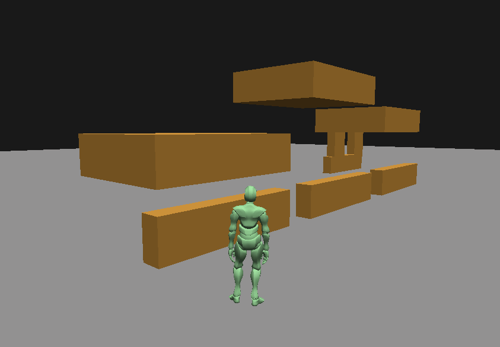

<br/>

# 트러블슈팅

## 1. 루트모션 보정 방식

### 문제
현재 사용하는 파쿠르 클립은 **특정 크기의 장애물**을 전제로 제작되어 있습니다.<br/>
Mixamo의 Vault 모션은 정확한 위치, 거리에서 시작해야 자연스러웠습니다.

그런데 실제 레벨의 장애물은 높이도 거리도 제각각일 것입니다.<br/>
루트모션을 그대로 재생하면

- 장애물이 멀면 → 손이 허공을 짚고 몸이 못 미침
- 장애물이 가까우면 → 몸이 장애물을 뚫고 지나감
- 높이가 다르면 → 발이 윗면에 안 닿거나 파묻힘

### 1차 해결 : 선형 보정
클립 재생 중 일정 구간 동안 캐릭터를 **루트모션에 적절한 지점으로 Lerp** 하는 노티파이를 만들었습니다.<br/>


인식 시스템 호출을 통해서 장애물의 위치, 모서리의 높이 등의 측정 결과값을 이용하여 모션을 보정했습니다.


```cpp
// Content/AnimNotify/CorrectRootMotion.cpp
Vector3 dir = obsPos - charPos;
dir.Normalize();
Vector3 properPoint = obsPos - dir * m_properDistance;   // 설정한 적정 거리만큼 떨어진 지점

// 애니메이션에 설정한 구간 동안 보간
const float w = m_elapsedTime / GetDuration();
Vector3 lerpedPos = Vector3::Lerp(charPos, properPoint, w);
```
보정하지 않을 축은 `ECorrectAxis`(`XZ` / `XY` / `YZ` / `None`)로 골라 시작값을 유지합니다.
수평 거리만 맞추고 높이는 클립에 맡기는 식입니다.

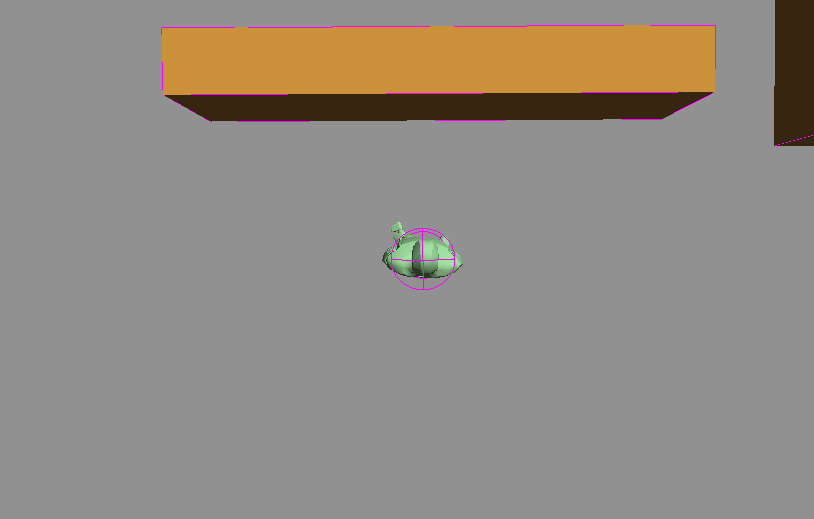
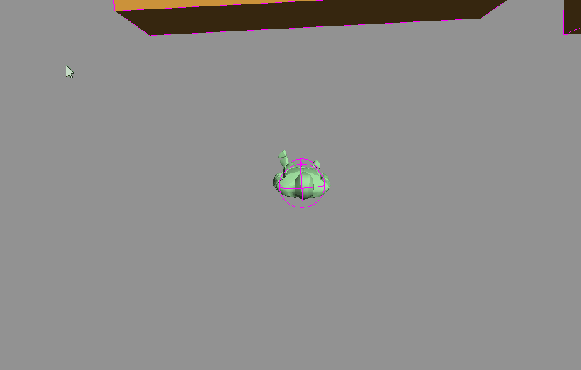

### 2차 해결 : 베지어 곡선 보정
선형 보정으로는 안 되는 상황이 있었습니다.<br/>
Vault의 경우 적절히 넘어가는 것을 자연스럽게 보여줄 수 있었습니다.<br/>
하지만 어딘가에 오르거나(Mantle) 다른 곳에 매달려야하는(Hanging) 경우는 캐릭터가 액션 중 정확한 위치로 이동해야 했습니다.

이때 선형 보간을 사용하여 시작점과 끝점을 직선으로 이으면 몸이 장애물 모서리를 **관통**합니다.
실제 동작은 위로 솟았다가 내려오는 **호**를 그려야 합니다.

그래서 정확한 위치로 이동할 필요가 있을 때의 루트모션 보정은 2차 베지어 곡선 방식으로 바꿨습니다. 
시작점은 현재 위치, 끝점은 인식된 모서리, 중간 제어점으로 곡선 모양을 만듭니다.


```cpp
// Content/AnimNotify/CorrectRootMotion.cpp
const float w = std::clamp(m_elapsedTime / GetDuration(), 0.0f, 1.0f);
Vector3 p1 = Vector3::Lerp(m_startPoint, m_midPoint, w);
Vector3 p2 = Vector3::Lerp(m_midPoint,   m_endPoint, w);
Vector3 p3 = Vector3::Lerp(p1, p2, w);
m_pChar->SetPosition(p3);
```

중간, 끝 오프셋은 **캐릭터 로컬 트랜스폼**(Right / Up / Forward)을 기준으로 합니다.
월드 좌표로 두면 캐릭터가 어느 방향을 보고 있느냐에 따라 값을 다시 잡아야 하기 때문입니다.

|  | `CorrectRootMotion` (선형) | `BezierCorrectRootMotion` (베지어) |
|---|---|---|
| 경로 | 직선 Lerp | 2차 베지어 |
| 축 제어 | `ECorrectAxis` 평면 선택 | 축별 `axisMask` |
| 저작 파라미터 | `properDistance` 하나 | mid / end 오프셋 (캐릭터 로컬축) |
| JSON 사용 수 | 10 | **43** |

둘은 대체 관계가 아니라 **연계**해서 씁니다. 
`VaultHigh` 는 짧은 선형 보정으로 거리, 정면을 정리한 뒤, 
정확한 위치로 이동이 필요할 땐 베지어 구간에서 호를 그립니다.

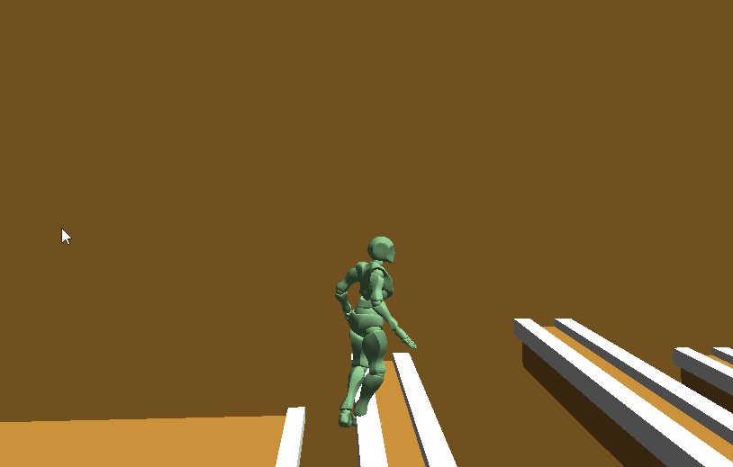

## 2. IK 도입 이유

### 문제
루트모션 보정으로 **몸통**은 장애물에 맞출 수 있게 됐습니다.
그런데 **손과 발의 접점**은 여전히 어긋났습니다.

보정은 캐릭터 루트를 목표 지점으로 옮길 뿐이고, 손발의 위치는 클립에 고정된 상대 좌표입니다.
장애물 높이가 애니메이션의 손,발 위치와 조금만 달라도 손이 모서리 위 허공을 짚거나 안으로 파묻힙니다.
몸 전체를 더 옮겨서 손을 맞추려 하면 이번엔 몸이 어색해집니다. 그러므로 **손, 발의 접점만 따로 고쳐야** 했습니다.

| 적용 전 | 적용 후 |
|---|---|
| 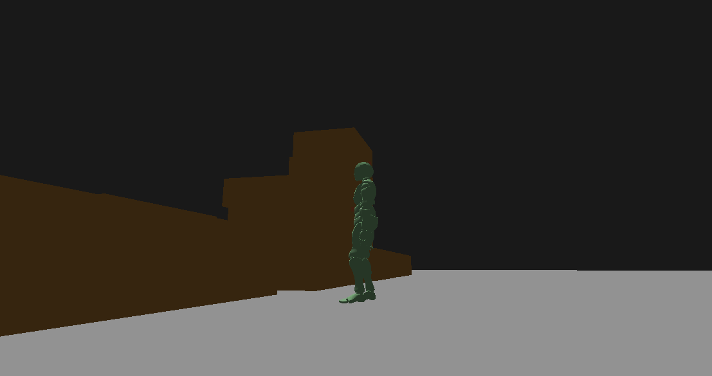 | 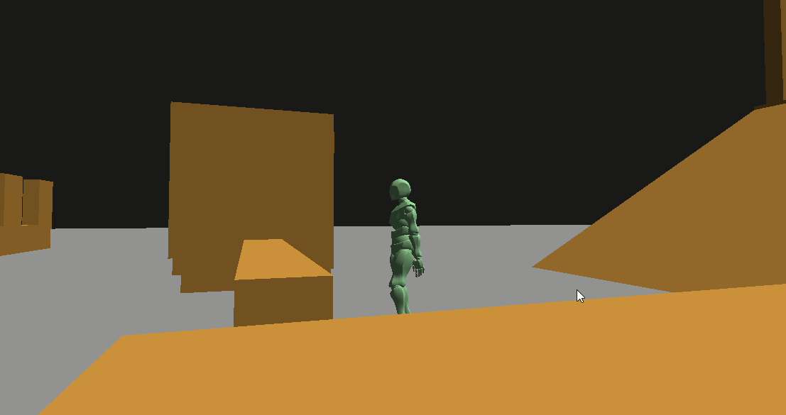 |

### 해결 : 두 종류 IK 적용
#### 상태에 따른 상시 IK
캐릭터 FSM에서 상태에 진입할 때 사지별 레이캐스트 작업을 예약하고, 빠져나올 때 해제합니다.

| 예약 시점 | 대상 | 하는 일 |
|---|---|---|
| `LandingState` 진입 | 양발 | 아래로 레이 → 지면 높이 · 경사 법선에 발을 맞춤 |
| `HangingState` 진입 | 사지 4 | 전방 스피어캐스트 → 벽면에 손발을 붙임 |
| `BeamHangingState` 진입 | 양팔 | 위로 스피어캐스트 → 빔을 잡음 |
| `PoleHangingState` 진입 | 사지 4 | 기둥 중심축에 XZ 스냅 |

넷 다 **액션 클립 재생 중에는 스스로 비활성화**됩니다. 
파쿠르 동작 중에는 모션에 노티파이 스테이트로 적용된 IK가 사지의 주도권을 가져가야 하기 때문입니다.

#### 노티파이 주도 파쿠르 IK
클립 타임라인에 IK 를 설정합니다.
- `CharacterIKEnabler` : 지정 구간 동안 IK 가중치를 `from → to` 로 램프
- `CharacterIKInvoker` : 매 프레임 목표를 **인식된 모서리**로 갱신

`VaultHigh`에 사용한 노티파이 스테이트 예시입니다.

```
클립 진행도  0.0 ────── 0.1 ────── 0.4 ────── 0.7 ── 0.8 ────── 0.9 ── 1.0
Bezier 보정          ├──────────── 몸통을 모서리로 ────────────┤
IKInvoker            ├──── 양손 목표 = 모서리 ─────────────┤
IKEnabler            ├ 0→1 ┤                        ├ 1→0 ┤
```

이 부분은 애니메이션 재생을 보고 노티파이 스테이트 구간을 설정합니다.
그러므로 필요에 따라 몸을 모서리로 날리는 구간과 손을 모서리에 고정하는 구간이 **겹칠 수 있습니다**.
몸이 이동하는 동안에도 손은 같은 월드 지점에 붙어 있어, 짚고 넘는 것처럼 보입니다.

# 회고
## 구조의 단점

데이터화로 얻은 것이 분명한 만큼 그 대가도 코드에 남아 있습니다.

### 1. 핫 리로드가 없습니다.
인식 트리와 규칙 테이블은 `BeginPlay` 에서 한 번 구축됩니다.<br/>
즉, JSON을 고쳐도 재실행해야 반영됩니다. <br/>
재컴파일은 없앴지만 **재실행 대기**는 남았고 데이터화로 얻으려던 이득의 절반쯤이 여기서 사라집니다. 

트리, 조건 객체가 이미 팩토리 패턴을 적용하여 재구축 자체는 어렵지 않지만<br/>
실행 중 교체 시점을 잡는 문제라 미뤘습니다.

### 2. 결과 처리 조건에 안 걸리면 액션 재생이 없습니다.
`if` 사다리는 브레이크포인트를 걸 수 있지만 규칙 테이블은 걸 데가 없습니다.
조건에 맞는 사항이 없다면 아무 모션을 실행시키지 않고 로그만 띄우다보니 
입력이 안 먹은 건지, 인식이 실패한 건지, 규칙에 구멍이 난 건지 구분되지 않습니다.

**어떤 규칙이 왜 걸렸는지**를 남기는 것이 데이터화의 필수 부품인데 나중에야 알았고,
작업 중 이 부분을 점검하기 위해 뒤늦게 디버그용 UI를 추가했습니다.

### 3. 새 노드, 데코레이터, 조건 객체 등의 추가 비용이 큽니다.
이미 있는 값의 조합은 JSON에 바로 적용할 수 있지만,<br/>
새로운 노드, 데코레이터, 조건 객체를 만들려면<br/>
클래스 선언, 판정 구현, 레지스트리 등록, 스키마 필드, 프로젝트 파일까지 4~6곳을 건드려야 합니다. 
조건을 **객체**로 만들었고 그걸 데이터화했기에 발생한 추가 작업입니다. 

값에 이름을 붙이는 방식 (필드 enum + 접근자)이었다면 새 요소 추가 작업이 한 곳 추가로 끝났을 텐데, 
그러면 OR 처리나 중첩 처리를 위해 표현식 트리를 따로 만들어야 합니다. 
어느 쪽이 나았는지는 아직 결론을 못 냈습니다.

## 타 사례에 대한 추가 분석 필요
작업을 마친 뒤 UE5 의 **Game Animation Sample** 과 **Lyra** 의 Traversal 구현을 보니,
결론적으로 비슷한 형태에 도달해 있었습니다.

- 지형을 여러 지점에서 재서 구조체로 만든다 → 이 프로젝트의 인식 트리
- 그 값을 **Chooser Table** 이라는 순서 있는 규칙 표에 넣어 몽타주를 고른다 → 규칙 테이블
- 고른 몽타주를 **Motion Warping** 으로 실제 지형에 맞춘다 → 베지어 루트모션 보정

같은 문제에서 출발하면 비슷한 구조로 수렴한다는 것을 확인했지만, <br/>
동시에 **차이가 나는 지점이 곧 제 구현의 약점**임을 인지하게 됐습니다.

- Chooser Table 은 **에디터 안에서 편집**하고 즉시 반영됩니다
- 어떤 행에서 매치됐는지 **도구로 확인**할 수 있습니다
- 상태 전이가 별도 그래프로 **명시**되어 있습니다

파쿠르 시스템을 위한 정형화된 시스템은 없었지만,
고도화된 애니메이션 시스템을 기반으로 지형인식 기능을 확장하는 형태였다면
구조를 설계하거나 시행착오했던 기간을 줄일 수 있었을 텐데 하는 아쉬움이 있습니다.

<br/>

# 기타
## 엔진 기반 상세
### 모듈 구성
단일 Visual Studio 프로젝트이고, 필터로 **Engine / Content** 를 나눴습니다.

| 구획 | 폴더 | 내용 |
|---|---|---|
| Engine | `Core/` | 그래픽 컨텍스트, 로그(spdlog), 타이머, 수학, 디버그 드로잉 |
| | `Asset/` | `.mini` 포맷 · 로더 · 스켈레톤 · 클립 · 루트모션 · IK 커널 · 본 이름 매핑 |
| | `Manager/` | Asset · Data · Path · Scene · UI 매니저 |
| | `Scene/` | Actor · Component · SceneComponent · Transform · 카메라 · 메시/강체/CCT 컴포넌트 |
| | `Physics/` | PhysX 월드, 충돌 레이어 |
| | `Animation/` | Animator · 상태머신 · 블렌드 · 액션 클립 · 노티파이 · 사지 IK |
| | `Perception/` | **인식 노드 · 데코레이터 · 처리 조건** (파쿠르 시스템 주요 클래스) |
| | `Editor/` | Assimp 베이커, 클립 편집 패널 |
| Content | `Content/` | Character · 상태머신 · 장애물 · 테스트 씬 · 데이터 애셋 · 파쿠르 노티파이 |

### 빌드 구성

| 구성 | 정의 | 용도 |
|---|---|---|
| `Debug` | `MG_DEBUG` | 일반 디버그 |
| `DebugUI` | `MG_DEBUG_UI` | **인게임 디버그 패널** — 인식 결과 · 레이캐스트 횟수 · 블렌드 상태 시각화 |
| `Editor` | `WITH_EDITOR` | Assimp 베이킹 + ImGui 에디터 |
| `Release` | `MG_RELEASE` | 최적화 |

`DebugUI` 를 따로 둔 이유는 디버그 표시에 필요한 `DebugName()`, `SetName()` 같은 멤버가 릴리스 빌드에서 객체의 크기를 늘리는 것을 피하기 위하고자 추가했습니다.

### 사용 라이브러리

| 목적 | 라이브러리 | 라이선스 |
|---|---|---|
| 물리 | NVIDIA PhysX 5 | BSD-3-Clause |
| 에디터 UI | Dear ImGui (win32 / dx11 바인딩) | MIT |
| 기즈모 | ImGuizmo | MIT |
| 애셋 임포트 | Assimp (Editor 구성 전용) | BSD-3-Clause |
| 수학 · 입력 | DirectXTK (SimpleMath / Keyboard / Mouse) | MIT |
| 로깅 | spdlog (+ fmt) | MIT |
| 데이터 | nlohmann/json | MIT |

의존성은 vcpkg 전역 통합(classic 모드)으로 연결합니다.

## 인식 노드 · 데코레이터 목록

### 노드 18종

| 분류 | 클래스 | 하는 일 |
|---|---|---|
| 합성 | `SequenceNode` | 자식을 순서대로 실행, 하나라도 실패하면 중단 |
| | `SelectorNode` | 조건을 통과한 자식을 순서대로 시도, 첫 성공에서 종료 |
| 탐지 | `DetectObstacleCapsuleNode` | 전방 캡슐 스윕 — 주력 장애물 탐지 |
| | `DetectObstacleSphereNode` | 전방 구체 스윕 |
| | `DetectLedgeNode` | 모서리 레이어 단일 탐지 |
| | `DetectLedgeMultipleNode` | 모서리 다중 탐지 후 **가장 높은 것** 선택 |
| | `DetectFloorNode` | 지면 · 장애물 레이어 하향 탐지 (착지용) |
| | `CheckObstacleSphereNode` | 존재 확인 전용 — 빗나가면 컨텍스트의 장애물을 비움 |
| 측정 | `MeasureObstacleHeightNode` | 높이 밴드 스캔 → 모서리 Y 확정 |
| | `MeasureObstacleDepthNode` | 윗면을 전진하며 하향 레이 → 깊이 |
| | `CheckRoomNode` | 머리 위 여유 공간 |
| 특수 지형 | `ProcessBeamNode` | 빔 — 장애물이 가진 모서리 정보를 직접 사용 |
| | `ProcessProtrudeNode` | 돌출물 — 접촉점을 장애물 중심으로 스냅 |
| | `ProcessPoleNode` | 기둥 — XZ 중심 스냅 + 잡을 수 있는 높이로 제한 |
| | `ProcessDirectNode` | 연출용 장애물 |
| 반환 | `ReturnResultNode` | 중간 결과를 최종 결과로 커밋 (**유일한 출력 지점**) |
| | `ReturnEmptyNode` | 항상 실패 — 명시적 "결과 없음" 가지 |
| 콘텐츠 | `DetectObstacleUsingInputNode` | 입력 방향(상하 우선)으로 스윕 방향 결정 |

### 데코레이터 7종

전부 `isInverted` 로 부정할 수 있고, 값 비교형은
`ECompareType { Greater, GEqual, Equal, LEqual, Lesser }` 를 갖습니다.

| 클래스 | 판정 |
|---|---|
| `ObstacleDetectedDecorator` | 장애물이 탐지되었는가 |
| `CompareObstacleTypeDecorator` | 장애물 종류 태그가 일치하는가 (`Default`/`Beam`/`Protrude`/`Pole`/`Direct`) |
| `CompareHeightDecorator` | (모서리 Y − 발 Y) 를 기준값과 비교 |
| `CompareDepthDecorator` | 측정된 깊이를 기준값과 비교 |
| `CharacterStateDecorator` | 캐릭터 상태 비교 |
| `InputVerticalDecorator` | 입력 세로축 비교 |
| `InputHorizontalDecorator` | 입력 가로축 비교 |

## 처리 조건 목록

조건 18종. 전부 `isInverted` 지원.

| 분류 | 클래스 | 판정 |
|---|---|---|
| 합성 | `ConditionAnd` | 자식 전부 만족 |
| | `ConditionOr` | 자식 중 하나 만족 |
| 장애물 | `ObstacleDetectedCondition` | 장애물 존재 |
| | `ObstacleTypeCondition` | 이번에 인식한 장애물의 종류 |
| | `LastObstacleTypeCondition` | 현재 처리 중인 장애물의 종류 |
| | `ObstacleHeightCondition` | 모서리가 발보다 기준값 이상 높은가 |
| | `ObstacleDepthCondition` | 깊이가 기준값 이상인가 |
| | `ObstacleIsFrontCondition` | 장애물이 캐릭터 정면에 있는가 |
| | `ObstacleHitDistanceCondition` | 접촉 거리가 기준값보다 먼가 |
| | `DetectLedgeCondition` | 저작된 모서리를 찾았는가 |
| | `DetectNewObstacle` | 직전과 다른 장애물인가 |
| | `CheckRoomCondition` | 여유 공간이 충분한가 |
| 캐릭터 | `CharacterStateCondition` | 현재 상태 |
| | `CharacterHeightCondition` | 모서리가 캐릭터 높이 + 여유 아래인가 |
| | `CharacterVelocityCondition` | 속도가 기준값보다 큰가 |
| | `CharacterFallingTimeCondition` | 낙하 시간이 기준값보다 긴가 |
| | `InputVerticalCondition` | 입력 세로축 (부호 인식) |
| | `InputHorizontalCondition` | 입력 가로축 (부호 인식) |

## 애니메이션 노티파이 목록

`time` 이 스칼라면 단발(`AnimNotify`), `[시작, 끝]` 이면 구간(`AnimNotifyState`)입니다.
사용 수는 `CharacterActionClips.json` 기준입니다.

| 클래스 | 종류 | 하는 일 | 사용 |
|---|---|---|---|
| `EnableCollisionObstacle` | 단발 | 장애물 레이어 충돌 on/off — 캡슐이 장애물을 통과 | **83** |
| `TransitionState` | 단발 | 캐릭터 상태 전이 | 45 |
| `BezierCorrectRootMotion` | 구간 | 2차 베지어로 위치 보정 | 43 |
| `CharacterIKEnabler` | 구간 | 사지 IK 가중치 램프 | 40 |
| `CharacterIKInvoker` | 구간 | 인식된 모서리로 손발 목표 갱신 | 40 |
| `CorrectRotationTowardObstacle` | 구간 | 장애물 접촉면을 향해 yaw 정렬 | 13 |
| `CorrectRootMotion` | 구간 | 선형 위치 보정 | 10 |
| `CheckIsFallingNotify` | 단발 | 발밑 확인 후 낙하 상태 강제 | 5 |
| `JumpTiming` | 단발 | 도약 프레임에 점프 실행 | 2 |
| `UseGravityNotifyState` | 구간 | 루트모션 중 중력 합산 허용 | 2 |
| `CorrectFixedRotation` | 구간 | 저작된 고정 각도만큼 회전 | 2 |
| `AddMovementNotify` | 단발 | 순간 이동 힘 | 1 |
| `CharacterIKInvokerFixedPoint` | 구간 | 캐릭터 정면 고정점에 손 고정 | 0 |
| `AddMovementNotifyState` | 구간 | 구간 동안 지속 이동 입력 | 0 |

## 빌드 방법

전제: vcpkg 전역 통합 (`vcpkg integrate install`).

```bat
:: 솔루션 위치
MiniEngine\Pakour\MiniEngine.sln

:: CLI 빌드
msbuild MiniEngine.sln /p:Configuration=DebugUI /p:Platform=x64
```

산출물은 `MiniEngine\Pakour\Build\x64\<Configuration>\` 에 생성되며,
빌드 후 이벤트가 `Datas\` 와 `Assets\` 를 출력 폴더로 복사합니다.